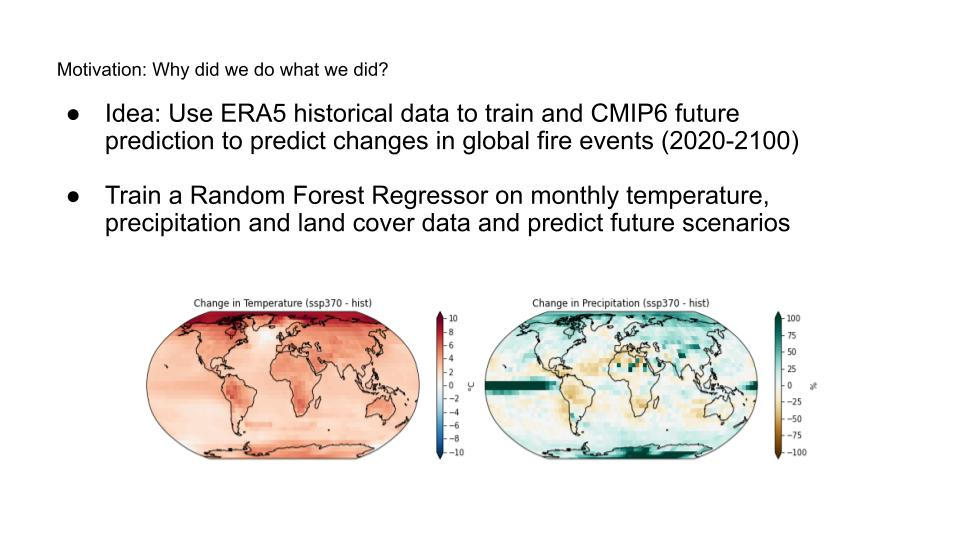
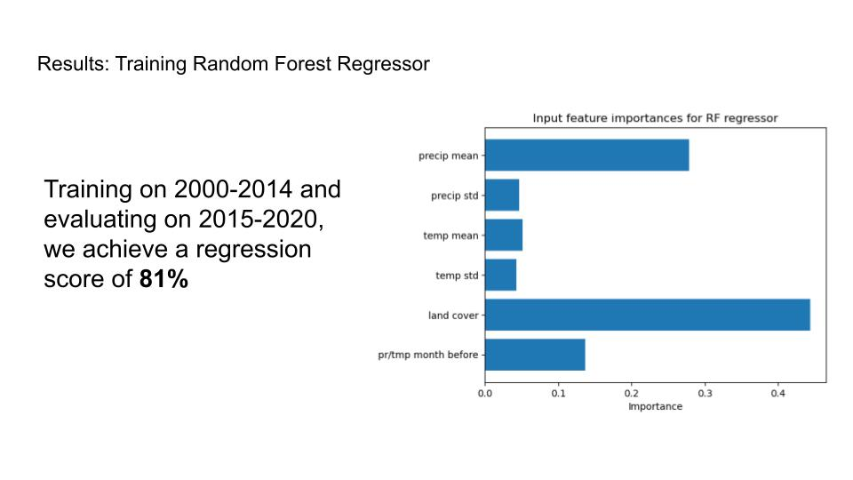
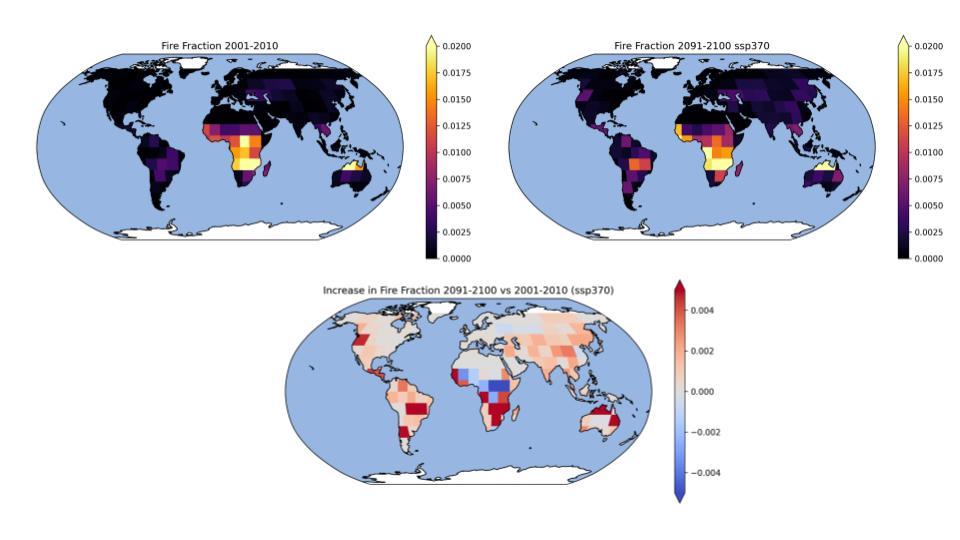

# AI for Climate - Forest Fires


For more information see `http://www.aivcc.uos.de <http://www.aivcc.uos.de/wordpress/index.php/about/>`_.

## Motivation

<p align="center">
  
</p>

## Data
-------


<p align="center">
  
</p>

## Methods and Scripts
---------------------

<p align="center">
  
</p>

To predict monthly forest fire counts per Modis tile do the following:

For training and validation on ERA5 data run:
```sh
$ python preprocess_for_train.py
$ python train_val_regressor.py --mode val
```

For predicting with CMIP projections run:

```sh
$ python preprocess_for_prediction.py
$ python train_val_regressor.py --mode pred
$ python rf_prediction.py
$ python post_process_prediction.py
```


## Results


<p align="center">
  
</p>
